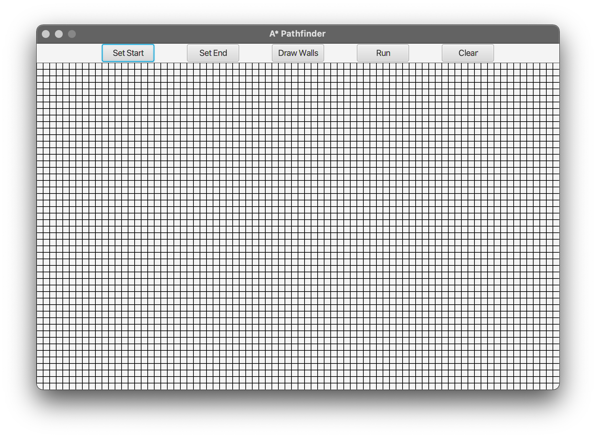

# pathfinder-gui
A GUI Pathfinder application utilising the A* algorithm and written in Java, using JavaFX as the GUI framework.

A full write-up of this project can be found [here](WRITEUP.md).

An executable JAR for this project can be found under [Releases](https://github.com/callumbirks/pathfinder-gui/releases).

## Screenshots

